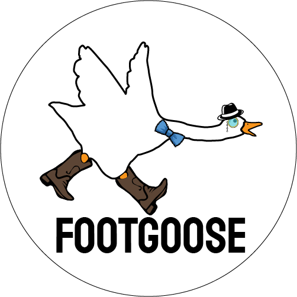

# FootGoose®

## Comision 5

## Grupo 6

### Integrantes:
- Grille Macarena  
  19 años.  
  Lanús, Buenos Aires.  
  Voluntaria en refugios de animales, Programadora Web Jr.
___
- Garcia Marcos  
  23 años.   
  Caseros, Buenos Aires.  
  Licenciado en Cs. Veterinarias, Chef de alta cocina, Programador Web Jr.
___

- Patiño Gabriel  
  24 años.  
  Moreno, Buenos Aires  
  Dueño de Pet Shop, Inversor en mercado Forex y Programador web Jr.
___

### Temática:
En nuestra empresa FootGoose® ofrecemos una amplia gama de productos y alimentos para su mascota, como así también un servicio médico ambulatorio para emergencias veterinarias.  
Somos la empresa líder en distribución y abastecimiento de insumos animales.
Nuestros clientes promueven a las mascotas como un miembro más de la familia, y a cambio nosotros les proveemos un servicio de primer nivel.

### Referencias:
- [Coca-cola](https://tienda.coca-cola.com.ar/amba/combos "Coca-cola")  
Fue elegida en base a su diseño minimalista y amigable con el usuario.

- [Whiskas](https://www.whiskas.com.ar/productos/ "Whiskas")  
Fue elegida en base a las animaciones de los productos.

- [Puppis](https://www.puppis.com.ar/perros/accesorios "Puppis")  
El concepto de catálogo con las cantidas, precios y descuentos nos pareció de lo más completo.

- [TimoteoPets](https://www.timoteopetshop.com/productos/?mpage=3 "Timoteo Pets")  
La sección de filtros muy específica nos pareció la indicada para el usuario exigente.

- [CentroPet](https://centropet.com/ "Centro Pet")  
La separación por animales permite a todos los usuarios ver los productos de su tipo de mascota sin tener que recurrir a los filtros. Una especie de atajo.

### Tipografías
- Staatliches (logo)
- Work Sans:  
Títulos (semi-bold 600)  
Textos y demás (regular 400)  
Copyright (extra-light 200 italic)  

### Colores
- #ebebeb  (body)
- #f2f2f2  (contenidos)
- #fad586  (Header, footer y botones)
- #55b054  (carritto y algunos botones)
- #ff0000  (Algunos botones)
- #e6ff00  (estrella de favoritos)
- #000000  (Textos)
- #ffffff  (Textos)

[Wireframes](https://github.com/Marcos676/Grupo_6_FootGoose/tree/main/wireframe "Wireframes")

[Bocetos](https://github.com/Marcos676/Grupo_6_FootGoose/tree/main/bocetos "Bocetos")

